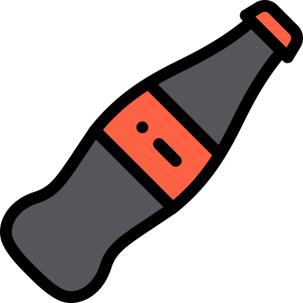

# coke-dreamworld-UI

[![LinkedIn][linkedin-shield]][linkedin-url]

<h2>Client</h2>

<b>Contract: Subvrsive</b>

<b>for The Coca-Cola Company</b>

<!-- PROJECT LOGO -->
 

 

  

<h3 align="center">UI for the Coca Cola Dreamworld project</h3>

  

UI elements | Made with html, css and javascript
  

https://github.com/victorcappa/coke-dreamworld-UI/assets/40408965/78a7f558-d10e-4c74-b08f-a893ac3804ae

<!--    GIF -->

<!-- ABOUT THE PROJECT -->
## About The Project

 

 
 This very interesting project allows the user to create murals of 3D objects in physical spaces, combining AR and the Visual Positioning System (VPS) technology, developed by Niantic.
 Not only can the user place 3D models, but we also developed editor tools for scale, style and rotation, allowing for a wide variety of creations. 
 

 
  <h3>UI</h3
   

  Besides the 2D landing page, for the city selection – as this is a location based application – there are also a lot of interesting UI elements, from object selection, to edition and screen capture.
  
   

(<a href="#top">back to top</a>)

<!-- LICENSE -->
## License

All intellectual property is owned by The Coca-Cola Company

<!-- CONTACT -->
## Contact

Reach out - <a href = "mailto: cappacurta@gmail.com.com">Victor Cappa</a>
<a href="https://www.linkedin.com/in/victor-cappa-50839788/">Linkedin</a>

(<a href="#top">back to top</a>)

[linkedin-shield]: https://img.shields.io/badge/-LinkedIn-black.svg?style=for-the-badge&logo=linkedin&colorB=555
[linkedin-url]: https://www.linkedin.com/in/victor-cappa-50839788/
